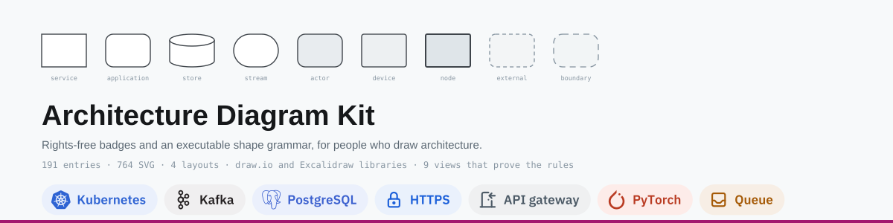
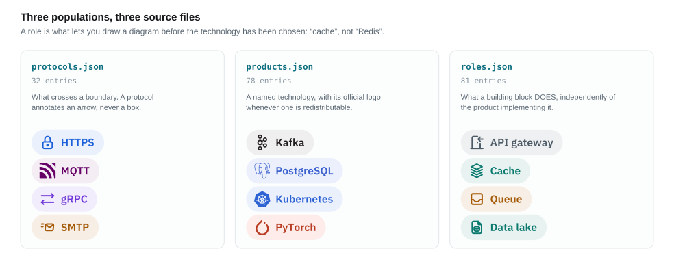
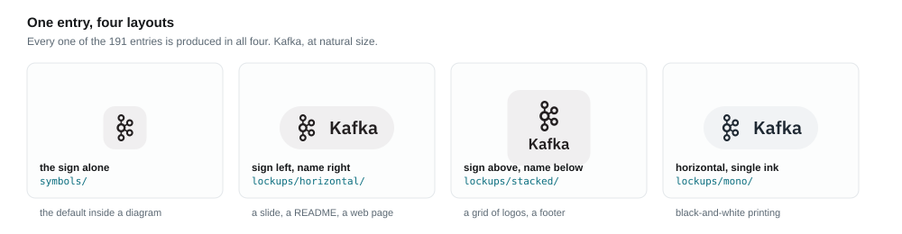
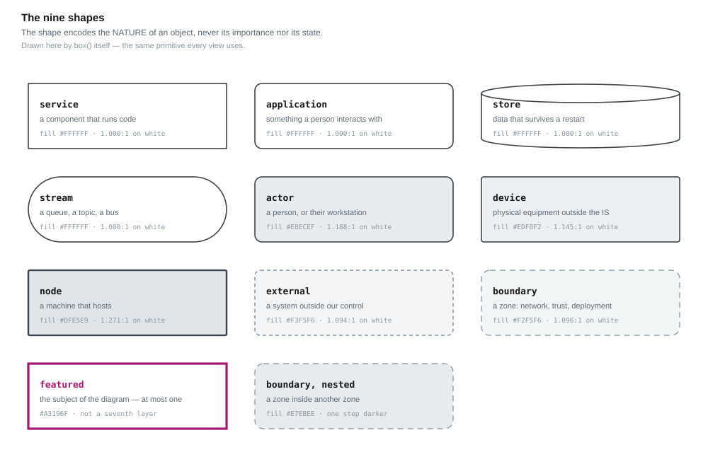
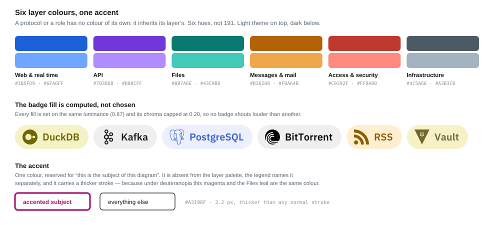
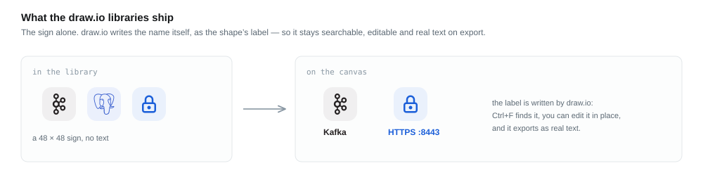
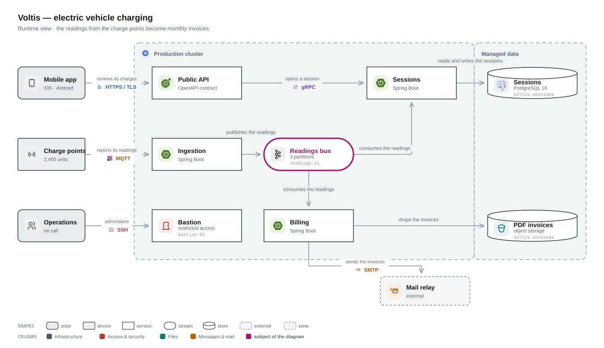

# Architecture Diagram Kit

**What it is.** A rights-free set of badges for the protocols, products and
infrastructure roles you draw in an architecture diagram — and the conventions
that turn them into a diagram rather than a pile of icons.

**Why it exists.** SSH, HTTP, FTP, REST, SMTP and DNS **have no official logo**:
they are specifications, not brands. Searching for “the FTP logo” never returns a
consistent result, because there isn't one. Consistency has to come from a
convention applied everywhere. This repository is that convention, made
executable: everything is generated, and the build refuses anything that breaks
a rule.

**One thing to know before the rest.** The literature is consistent on a single
point — what decides whether a diagram reads is almost never what you spend time
on. One arrow crossing removed is worth more than all the iconography in the
world. Badges do nothing for a badly laid-out diagram. That is why half this
repository is the [state of the art](docs/state-of-the-art-diagrams.md) and a
[review checklist](docs/diagram-review-checklist.md).

Licence: **[0BSD](LICENSE)** — no attribution, no conditions. The third-party
glyphs it redistributes keep their own terms; see [NOTICE.md](NOTICE.md).

---

## How the set is organised



Three source files, three questions:

- **`protocols.json`** — what crosses a boundary. A protocol annotates an
  **arrow**, never a box, and carries no shape.
- **`products.json`** — a named technology, with its official logo whenever one
  is redistributable.
- **`roles.json`** — what a building block **does**, independently of the product
  implementing it: `cache`, not `Redis`. This is what lets you draw a diagram
  *before* the technology has been chosen — and it is the part of the set least
  tied to any one architecture. See the [scope audit](docs/scope-audit.md).

Add an entry, run `./regenerate.sh`, and every artefact follows.

## Four layouts, for every entry



| Directory | Use |
|---|---|
| `symbols/` | **the default inside a diagram** — in a box, or on an arrow with its name beside it |
| `lockups/horizontal/` | outside a diagram — a slide, a README, a web page |
| `lockups/stacked/` | a grid of logos, a footer |
| `lockups/mono/` | black-and-white printing, an already coloured diagram |

Every file is **self-contained**: colours baked in, text vectorised, no font to
install. Drop one into Figma, a slide, a README, a web page.

**A lockup does not annotate an arrow.** It is about 150 px wide for arrows that
are 82: laid on one it spills onto the boxes, laid above it floats without saying
which arrow it belongs to. An arrow is annotated with the symbol and the name
laid *on* the line, which breaks behind them — the arbitration is in
[`docs/candidates-arrows.svg`](docs/candidates-arrows.svg).

<details>
<summary><b>Three marks write their own name — and get no label</b></summary>

`.NET`, `Go` and `vmware` have no symbol: they **write** the name, full stop.
Setting our label beside them would write it twice, and dual coding asks for a
sign **and** a text, not two texts. **3 entries** carry `"logotype": true`, their
lockup is the mark alone, and the build refuses to lay the word back on it.

The mark still had to be legible: inscribed in the square of the `viewBox`, the
“vmware” band — 24 × 3.8 units — wrote at 4.7 px tall. It is now placed by its
**measured ink** (`scripts/ink-box.mjs`), at the cap height the word had. Helm
and MySQL stay outside: their mark carries a symbol, and its lettering is
illegible at our sizes, so the word does real work there.
</details>

## The shape conventions



Nine shapes, **normative and closed**. The shape encodes the **nature** of an
object — never its importance, never its state. A critical component does not get
a special shape: it gets the accent.

The rules that matter in practice:

1. **One nature, one shape, across the whole corpus** — not just inside one
   diagram.
2. **Nine shapes, and not one more.** Adding one means removing one.
3. **Shape takes precedence over colour.** Every diagram must stay readable
   desaturated; shape survives black and white, colour does not.
4. **Shape and label, always both.** A shape without a name is not a shortcut,
   it is a riddle.
5. **Boundaries nest or separate, they never overlap.**

Three shapes are explicitly ruled out: the **diamond** (a decision belongs to a
flowchart), the **cloud** (it means “the internet”, “a cloud provider” or “I
don't know”, depending on the reader) and the **hexagon** (no established
meaning). Defined in [`shapes.json`](shapes.json); the build fails on an unknown
shape. Full reasoning: [ADR 0003](docs/adr/0003-shape-grammar.md), amended by
[0005](docs/adr/0005-node-shape-and-clarifications.md) and
[0007](docs/adr/0007-fill-scale-and-accent.md).

## The colours



**Six hues, not 191.** A protocol or a role has no colour of its own: it inherits
its layer's. Beyond six to eight categories a reader stops recognising them and
goes back to the legend at every box — so the palette is capped, and a legend of
six entries is memorable. Products are the exception: a level-1 logo keeps its
own brand colour, because that colour is part of the recognition.

**The badge fill is computed, not chosen.** A fixed share of the hue gives pills
of very uneven weight — at 14 %, BitTorrent's black drops to 0.72 of luminance
while RSS's orange stays at 0.90. Every fill is therefore set on the same
luminance (0.87), its chroma capped at 0.20 so no badge shouts louder than
another, and the ink darkened until it reaches 4.5:1 on its own fill.

**The accent is not a seventh layer.** One colour says only “this is the subject
of this diagram”, one box per diagram, declared separately in the legend. It
carries a thicker stroke as well as a hue — because under deuteranopia this
magenta and the Files teal are the same colour, and the rule “never colour alone”
applies to it first.

Every view also has a **dark twin** (`-dark.svg`), where the value scale is
turned over but the brand marks are left untouched: inverting Spring Boot's green
would produce a false logo.

## Importing into draw.io



**Do not import `lockups/` into draw.io — install the libraries.**

1. `File ▸ Open Library from ▸ Device…`
2. Pick `drawio/protocols.xml`, `drawio/products.xml`, `drawio/roles.xml` and —
   most importantly — `drawio/grammar.xml`, which carries the nine shapes, their
   fills, the accent and the annotated arrow.
3. The libraries appear as extra palettes in the left sidebar. Drag a shape onto
   the canvas and type its name.

**To start from an example rather than a blank page**, `File ▸ Open from ▸
Device…` and pick [`drawio/examples.drawio`](drawio/examples.drawio): the ten
views listed below, one per page tab, with every box movable, every label editable and
every arrow bound to the boxes it joins.

They ship the **sign alone**, and draw.io writes the name itself. The label
therefore stays searchable with `Ctrl+F`, editable in place (`HTTPS :8443`), and
exports as real text a screen reader can read. Details:
[`drawio/README.md`](drawio/README.md) · reasoning:
[the state of the art, §5](docs/state-of-the-art-diagrams.md#5-the-consequence-for-drawio).

**Excalidraw** is the secondary route: `excalidraw/badges.excalidraw` is a
**scene** to open and copy-paste from, because Excalidraw's library format cannot
carry images. `excalidraw/grammar.excalidraw` carries the grammar and writes on
itself what it loses on the way — see
[ADR 0004](docs/adr/0004-excalidraw-secondary-route.md).

## Examples

The 10 views below, each exercising the grammar at one level of abstraction. They are
generated by the same primitives as everything else, so a broken rule shows up
here first.

| View | Level |
|---|---|
| [Context](docs/example-context.svg) | who uses the system, and what it talks to — C4 level 1, with descriptions |
| [Runtime](docs/example-voltis.svg) | the system in operation, badges and annotated arrows |
| [Subsystems](docs/example-domains.svg) | an experience layer over four domains — a subsystem is a perimeter holding a service *and* a store |
| [Foundation](docs/example-infra.svg) | machines, network, virtualisation |
| [Platform](docs/example-k8s.svg) | a Kubernetes cluster — the VMs above are the nodes here |
| [Component](docs/example-component.svg) | inside one service: inbound, domain, outbound |
| [Delivery](docs/example-delivery.svg) | from change to deployment — none of it exists at runtime |
| [Layered](docs/example-layers.svg) | a marketplace in three bands, with the sizing of each block |
| [Analytics](docs/example-analytics.svg) | a deliberately different style: no cluster, no long-running service, no JVM |
| [Full](docs/example-full.svg) | all nine shapes, nested zones, the accent and the three label regimes on one page |

[](docs/example-voltis.svg)

*The runtime view: symbols inside the boxes, the protocol and the intent on the
arrows, one accented subject, and a legend derived from the content so it cannot
lie.*

## Regenerating

```bash
./regenerate.sh              # downloads the pinned npm packages, then rebuilds everything
./regenerate.sh --offline    # rebuilds from an already downloaded .cache/
```

Node ≥ 18 and npm. Nothing else. Versions are pinned in `regenerate.sh`.

**Everything in this repository is generated, and everything is checked.** The
build refuses an unknown shape, a pictogram shared by two entries, a cylinder too
short for its label, an arrow label covering a box, a description overflowing,
the legend landing on a node, text unreadable in the dark variant, a grammar fill
missing from a library, a logotype whose name gets written twice, and any number
in the documentation that no longer matches its source. CI re-runs the whole
regeneration and then asserts the git tree is clean — which proves the versioned
output matches its sources.

## Structure

```
protocols.json            source of truth: 32 protocols
products.json             source of truth: 78 products
roles.json                source of truth: 81 roles
shapes.json               the shape grammar
scripts/layers.json       the 6 coloured layers
regenerate.sh             rebuilds everything from npm

lockups/horizontal/       191 SVG · default layout
lockups/stacked/          191 SVG · diagram node
lockups/mono/             191 SVG · single ink
symbols/                  191 SVG · sign alone

drawio/protocols.xml      draw.io shape library · 32
drawio/products.xml       draw.io shape library · 78
drawio/roles.xml          draw.io shape library · 81
drawio/grammar.xml        the grammar: shapes, fills, accent, annotated arrow

excalidraw/               two scenes: the badges, and the grammar
sources/                  raw glyphs, as published upstream
licenses/                 the licence texts of what is redistributed

mapping.csv / .json       correspondence table
specimen/                 reference sheets, in a browser
docs/                     state of the art, checklist, audits, decisions (ADR)
```

## Documentation

**Making diagrams**

- [What the research says about diagrams](docs/state-of-the-art-diagrams.md) —
  Moody, Purchase, Petre, the meta-analysis on spatial contiguity, C4
  ([laid out](docs/state-of-the-art-diagrams.html))
- [Making a diagram that reads](docs/shapes-colors-arrows.html) — the practical
  guide: which shape, the colour rules, arrows, spacing, the greyscale test
- [Reviewing a diagram — the checklist](docs/diagram-review-checklist.md) — nine
  points, in the order of measured impact
- [Scope audit](docs/scope-audit.md) — does this set serve an architect, or one
  architecture? The counts, the gaps, and what was added
- [Our choices against the established conventions](docs/conventions-audit.md) —
  C4, C4-PlantUML, draw.io, AWS

**Decisions**

- [0001 — Six layer colours, imposed](docs/adr/0001-six-layer-colours.md)
- [0002 — Reuse the official logo as soon as one exists](docs/adr/0002-reuse-existing-logos.md)
- [0003 — A shape grammar, normative and closed](docs/adr/0003-shape-grammar.md)
- [0004 — Keep the Excalidraw route, second](docs/adr/0004-excalidraw-secondary-route.md)
- [0005 — A ninth shape: the deployment node](docs/adr/0005-node-shape-and-clarifications.md)
- [0006 — Qualities are markers, not badges](docs/adr/0006-quality-markers.md)
- [0007 — Widen the fill scale, and accent one subject per diagram](docs/adr/0007-fill-scale-and-accent.md)
- [0008 — A logotype does not write its name twice](docs/adr/0008-logotypes.md)

## Adding an entry

A product, in `products.json`:

```json
{ "slug": "redis", "label": "Redis", "family": "Data",
  "simpleIcons": "redis", "shape": "store" }
```

Look for the logo on [simpleicons.org](https://simpleicons.org) first. If none
exists, set `"simpleIcons": null` and give a fallback pictogram plus a colour:
`"tabler": "database", "color": "#0B7A6E"`, with a `note` explaining why — the
specimen sheet displays it.

A protocol, in `protocols.json`:

```json
{ "slug": "quic", "label": "QUIC", "family": "Network",
  "tabler": "bolt", "lucide": "zap", "simpleIcons": null }
```

Add `"officialMark": true` only if the `simpleIcons` logo designates the protocol
itself, and not an implementation — RabbitMQ is not AMQP.

The build fails with an explicit message if the icon name does not exist, if the
pictogram is already taken by another entry, or if the family has no layer. Icon
names: [tabler.io/icons](https://tabler.io/icons),
[lucide.dev](https://lucide.dev), [simpleicons.org](https://simpleicons.org).

## Licence

**[0BSD](LICENSE)** for everything this repository owns — no attribution, no
conditions.

It redistributes third-party glyphs that keep their own terms: Tabler (MIT) and
Lucide (ISC) **require their copyright notice to be preserved**, Simple Icons is
CC0. The texts are vendored in [`licenses/`](licenses/).

**Free of rights is not free of trademark.** The logos remain the property of
their holders: they designate the technology, never a partnership or a
certification. See [NOTICE.md](NOTICE.md).
